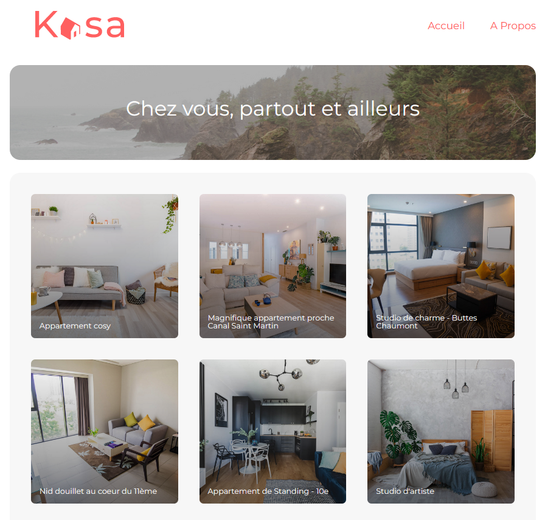
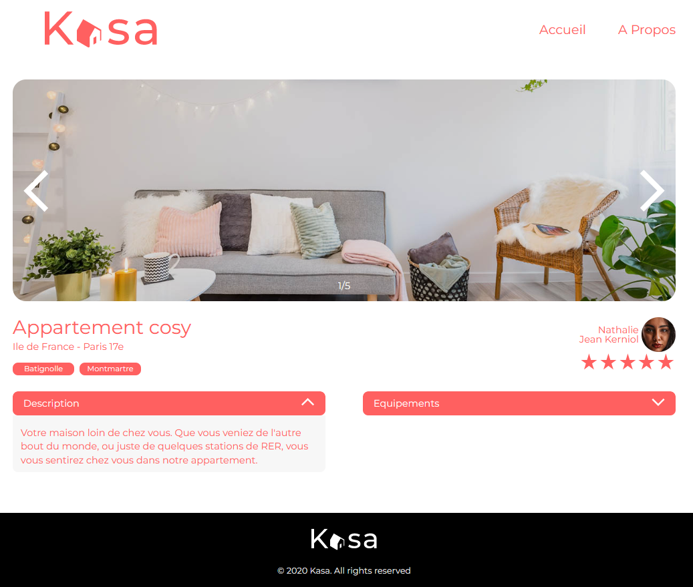
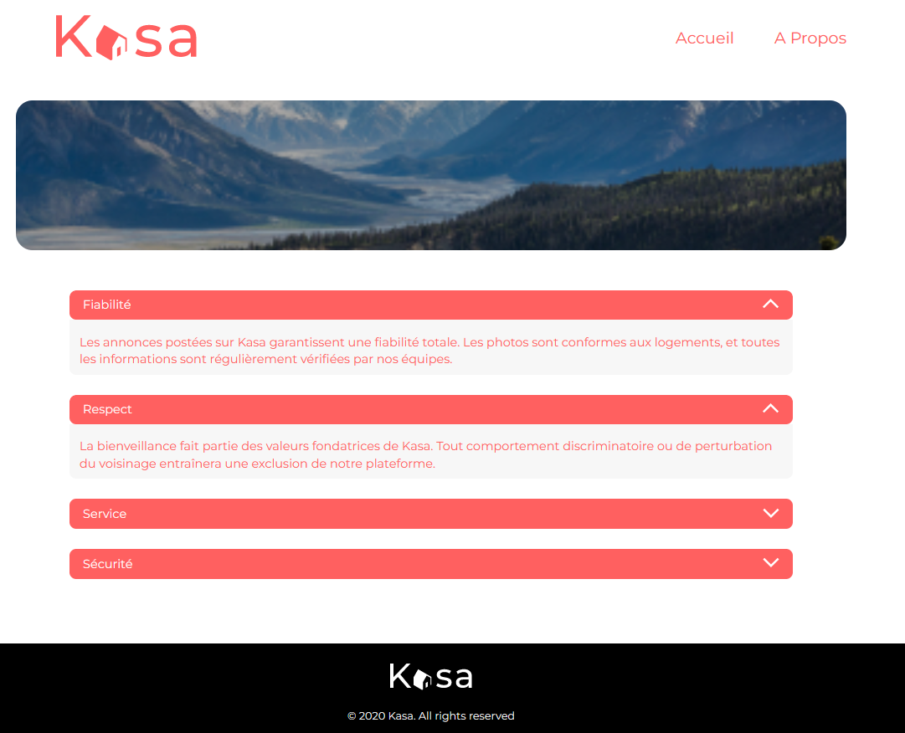

## Kasa - Find your next appartment !
7th project of the OpenClassrooms web-developer path
## Table of Contents
1. [General Info](#general-info)
2. [Technologies](#technologies)
3. [Installation](#installation)
## General Info
***
[](https://www.repostatus.org/#inactive)

Kasa is an application that allows people to find appartments between individuals. Kasa interface enables people to connect directly with each other.

Implementation of the application's frontend with React.  
Simulation of a backend with json-server.  
AWS hosting both frontend and backend.

The different parts of this project were:
* Initialize an application with `Create React App`
* Develop the interface elements of a website with `React components`
* Configure the navigation between the pages of the application with `React Router`
* Building the layout with `CSS modules`

Checkout here for more details about the mockups and technical specifications of this project :
* [technical_sepcifications]( Coding+guidelines+Kasa+FR.pdf)
* [mockups](UI-Design-Kasa-FR(Copy).pdf)

Checkout the URL to take a look : http://174.129.147.249:3000/

### Screenshots
Home Page
Page de description d'un logement Page About
## Technologies
***
A list of technologies used within the project:
* **Server:**
* **Client:**  

## Installation
***
```
  git clone https://github.com/lmleopold/Kasa.git
```
### Back end prerequisites

To run the backend you must have `Node`, `npm` and `JSON Server` installed.

to install JSON Server run:  `npm install -g json-server`

### Back end Installation ###


* Clone the repo. 
* Go to the "backend" folder of the project `cd kasa/backend`
* Start JSON Server: `json-server --watch ./data/db.json --port 2000`

Now if you go to http://localhost:2000/accomodations, you'll get the data.

### Front end installation ###

* Got to the "front end" folder: `cd ../kasa/frontend`
* Run `npm install`

Then you can run the app in the development mode.:
* Run `npm start`

Open [http://localhost:3000](http://localhost:3000) to view it in your browser.